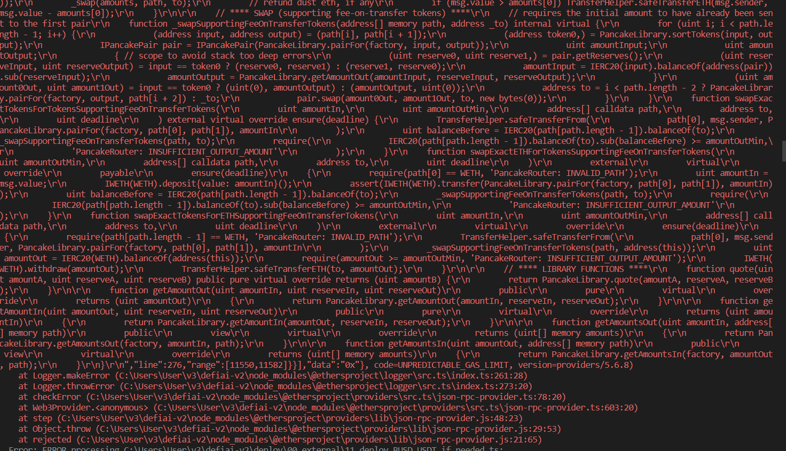
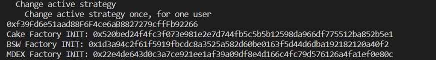
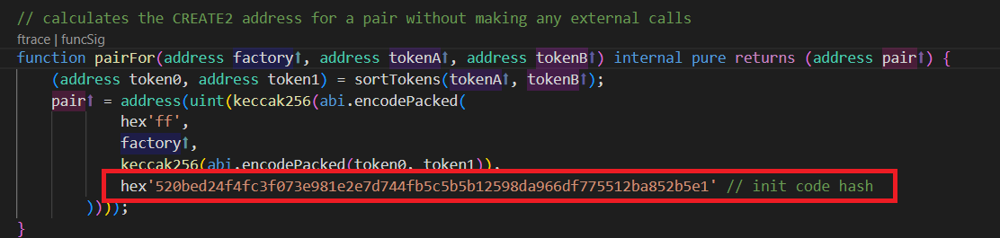
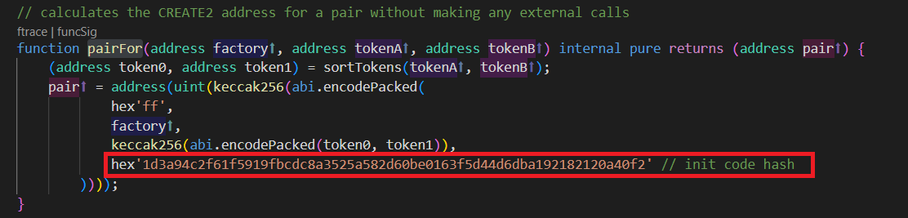

# Tutorial to deploy and test contracts

# 1. Setting up the environment

Most Ethereum libraries and tools are written in JavaScript, and so is **Hardhat**. If you're not familiar with Node.js, it's a JavaScript runtime built on Chrome's V8 JavaScript engine. It's the most popular solution to run JavaScript outside of a web browser and **Hardhat** is built on top of it.

## Installing Node.js

You can [skip](./creating-a-new-hardhat-project.md) this section if you already have a working Node.js `>=12.0` installation. If not, here's how to install it on Ubuntu, MacOS and Windows.


### Linux

#### Ubuntu

Copy and paste these commands in a terminal:

```
sudo apt update
sudo apt install curl git
curl -sL https://deb.nodesource.com/setup_12.x | sudo -E bash -
sudo apt install nodejs
```

### MacOS

Make sure you have `git` installed. Otherwise, follow [these instructions](https://www.atlassian.com/git/tutorials/install-git).

There are multiple ways of installing Node.js on MacOS. We will be using [Node Version Manager (nvm)](http://github.com/creationix/nvm).

Copy and paste these commands in a terminal:

```
curl -o- https://raw.githubusercontent.com/creationix/nvm/v0.35.2/install.sh | bash
nvm install 12
nvm use 12
nvm alias default 12
npm install npm --global # Upgrade npm to the latest version
```

### Windows

Installing Node.js on Windows requires a few manual steps. We'll install git, Node.js 12.x and npm.

Download and run these:
1. [Git's installer for Windows](https://git-scm.com/download/win)
2. `node-v12.XX.XX-x64.msi` from [here](https://nodejs.org/dist/latest-v12.x)


## Upgrading your Node.js installation

If your version of Node.js is older than `12.0` follow the instructions below to upgrade.

### Linux

#### Ubuntu

1. Run `sudo apt remove nodejs` in a terminal to remove Node.js.
2. Find the version of Node.js that you want to install [here](https://github.com/nodesource/distributions#debinstall) and follow the instructions.
3. Run `sudo apt update && sudo apt install nodejs` in a terminal to install Node.js again.

### MacOS

You can change your Node.js version using [nvm](http://github.com/creationix/nvm). To upgrade to Node.js `12.x` run these in a terminal:

```
nvm install 12
nvm use 12
nvm alias default 12
npm install npm --global # Upgrade npm to the latest version
```

### Windows

You need to follow the [same installation instructions](#windows) as before but choose a different version. You can check the list of all available versions [here](https://nodejs.org/en/download/releases/).

## Installing yarn

To install it do the following:

```
npm install -g yarn
```
<br>

# 2. Install required packages and dependencies

To install required packages and dependencies, do the following:

```
yarn
```

followed by

```
npm i
```
<br>

To install hardhat, run: 

```
npm install hardhat

npm install --save-dev "hardhat@^2.9.1" "@nomiclabs/hardhat-waffle@^2.0.0" "ethereum-waffle@^3.0.0" "chai@^4.2.0" "@nomiclabs/hardhat-ethers@^2.0.0" "ethers@^5.0.0"
```

To install the hardhat deploy package, do:
```
npm i hardhat-deploy
```
<br>

# 3. Compiling the contracts

To compile the contracts, run:
```
npx hardhat compile
```

<br>

# 4. Deploying the contracts

To deploy the contracts, run the following:

```
npx hardhat deploy --tags DEFIAI,DEFIAIFarm_deploy,DEFIAIFarm_init
```

This will deploy the contracts to your local environment.
> **_NOTE:_**  Do make sure the "--tags" is greyed-out, if it is not, try retyping the "--tags" in the terminal

<br>

# 5. Running the test scripts
To run the test scripts, run this command in a terminal:
```
npx hardhat test

```
If you encounter this error:
<br></br>

<br></br>
Rerun "npx hardhat test", but stop the execution with Ctrl+C, once this appears: 
<br></br>

<br></br>
Then, go to contracts/solc_0.6/pcs/PancakeRouter.sol, find this function:
<br></br>

<br></br>
Replace the hex value with the Cake Factory INIT value
<br></br>


Go to contracts/solc_0.6/bsw/BiswapRouter02.sol, find this function:
<br></br>

Replace the hex value with the BSW Factory INIT value
<br></br>

<br></br>
Run "npx hardhat test" again:
```
npx hardhat test

```


# Flow
 1. Normal Flow
    - User deposits into farm
    - Time passes
    - User withdraws from farm and get their rewards

    <br>

 2. User deposits twice Flow
      - User deposits into farm
      - Time passes
      - User deposits again into farm, receives rewards from previous deposit
   
   <br>

 3. Dev/Owner change strategy
    - User deposits into farm
    - Time passes
    - Dev/Owner changes strategy
    - User withdraws from farm (inactive) and get their rewards
    - User deposits into farm again, but this time it has a different strategy, earning different type of reward token
    <br>
# Requirements
 1. Users are able to deposit into farm
 2. Users are able to withdraw from the farm anytime, as long as it is not in the same block/next block with their deposit
 3. Users will get their rewards (CAKE/MDX/BSW) when they deposit again/withdraw
 4. Developers are able to get 30% of the rewards earned by the user every time user deposits/withdraws
 5. Developers are able to change the active strategy
 6. Users have to withdraw their balance from the previous strategy and restake them into the new active strategy on their own
 7. Users are able to withdraw their balance from previous pools, even after the strategy has changed
 8. Developers are able to emergency withdraw to take any residue left in the contract

<br>

# Notes

### Note for time-independent accumulated reward distribution:
- For every action a shareholder takes (deposit/withdraw), their reward (if any) will be harvested from the pool, and distributed to the shareholders, before updating their share (due to the deposit/withdraw). As such, there is no unfair reward distribution. There is hence no need to record the passage of time, as we are able to distribute their reward (CAKE/MDX/BSW), based on thier shares.
<br></br>

### Note for block numbers:
- Block numbers are not used for calculation purposes. They are only used to record the block for users' last deposit, and prevent them from making a withdrawal in the same/next block, to prevent a flashloan attack.

### Note for testnet environment
- The main contracts of the system are DeFiAIFarmv2.sol, DeFiAIStrat.sol, IDefiMultiStrat.sol and IDeFiAIStrat.sol. Besides these contracts, the other third-part contracts are used for the testnet and unit testing environments for the purpose of mocking the mainnet environment. The mainnet deployment will be using the respective contracts already deployed by the third-party farms.


 
